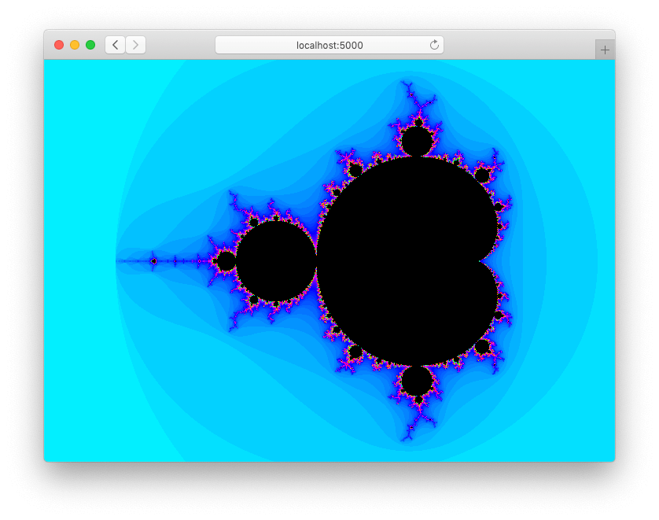

# mandelbrot

[Mandelbrot set](https://en.wikipedia.org/wiki/Mandelbrot_set) in Rust targeting
WebAssembly, online at [mandelbrot-rust.web.app](https://mandelbrot-rust.web.app/).

[](https://mandelbrot-rust.web.app/)

## Controls

- Left click to zoom in.
- Right click to zoom out.

## Development

Install dependencies.

```sh
script/setup
```

Build Rust and web frontend.

```sh
script/build
```

Serve frontend at [localhost:5000](http://localhost:5000/).

```sh
script/serve
```

Alternatively, start development server with live-reload.

```sh
script/start
```

## License

Licensed under either of

- Apache License, Version 2.0
  ([LICENSE-APACHE](LICENSE-APACHE) or http://www.apache.org/licenses/LICENSE-2.0)
- MIT license
  ([LICENSE-MIT](LICENSE-MIT) or http://opensource.org/licenses/MIT)

at your option.

## Contribution

Unless you explicitly state otherwise, any contribution intentionally submitted
for inclusion in the work by you, as defined in the Apache-2.0 license, shall be
dual licensed as above, without any additional terms or conditions.
